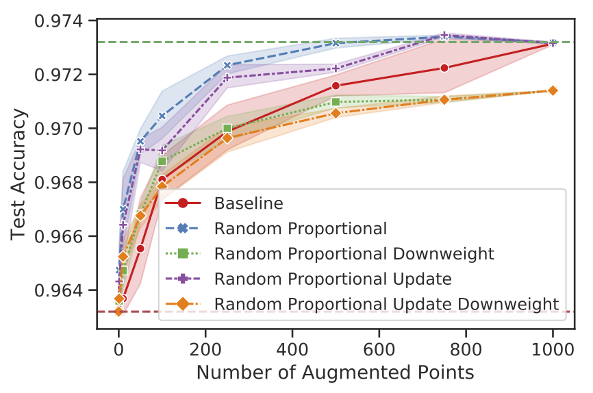

# Efficient Augmentation via Data Subsampling

This repository contains code for the paper:

> **[Efficient Augmentation via Data Subsampling](https://arxiv.org/abs/1810.05222)**
>
> **Michael Kuchnik, Virginia Smith**
>
> **International Conference on Learning Representations (ICLR), 2019**

## Summary
Data augmentation is the process of applying class-preserving transformations to
data to improve generalization performance.
It's responsible for a large portion of the progress in modern deep learning
systems, yet the performance of data augmentation on a per sample basis hasn't
been studied well.
Augmentation is typically applied to all images, which is computationally wasteful and can lead
to a variety of problems downstream.
For instance, it's harder to debug incorrect predictions when data augmentation
has increased the size of the training set by a large factor.
Why apply augmentations to all images if equivalent performance can be obtained
by augmenting a small subset of those points?

This work is about reducing the amount of data points that are augmented without
giving up out of sample generalization ability.
We investigate augmentations applied to a subset of the
training set.
We focus on three types of augmentation: **translation**, **rotation**, and **crop**.

<p align="center">
  
  
  
</p>

The policies we explore use score functions based off of the training point's
**loss** or **Leave-One-Out (LOO) influence**.
We demonstrate that policies weighted by score functions
can achieve the same benefits as full augmentation with a fraction of the
augmentation budget.

For example, with a CIFAR-10 task, translation augmentations, and LOO influence, we achieve the
following results (the red horizontal line corresponds to no augmentation and the green line is with full
augmentation):



From this plot, we can observe that:
1. Random sampling yields reasonable performance for a small number of data
   points.
2. Smarter sampling policies, such as those based off of model influence or
   loss, can greatly improve upon random policies.

The difference in performance between random and score-driven policies comes from the points that are chosen to be augmented.
Random policies select points uniformly at random, while score-driven policies
select points with probability proportional to their scores.
High scoring points correspond to the points with higher variation relative to
the rest of the training set.


Lower scoring points are typically visually similar and easy to classify.


From this, we can infer that augmenting the harder examples can
yield better generalization performance than augmenting random points.
Please see the full paper for more details.

## Quick Start
A docker CIFAR-10 example is prepared which is relatively fast to run (about an hour or less).
To run it with CPU:
```console
bash scripts/run_cifar_example.sh
```

To run it with GPU (requires nvidia-docker to be installed):
```console
bash scripts/run_cifar_example_gpu.sh
```

Otherwise, you can run it without docker with:
```console
bash scripts/cifar_example.sh
```

The results are visualized in PDF form.
The visualization script attempts to generate plots for all datasets (i.e.,
including MNIST and NORB), so it's expected that errors will be thrown for those
datasets.
It's safe to ignore these errors when they are printed in the console as the
script will simply skip those cases.

The corresponding calls to run over all datasets are:
```console
bash scripts/run_all_example.sh
```

and
```console
bash scripts/run_all_example_gpu.sh
```


## Dependencies

Python3 is used for nearly all experiments (there is a small amount of Matlab
code).
Python dependencies are listed in the *requirements.txt* files.
Further dependencies, such as Octave, are included in the Docker builds.

### DPP code
Please run the get\_dpp\_code.sh script before running DPP experiments.
This will download required external dependencies.
```console
bash scripts/get_dpp_code.sh
```

### Docker
If you are using nvidia-docker, please install using the directions in their
wiki:
https://github.com/nvidia/nvidia-docker/wiki/Installation-(version-2.0)

## Details of Running Experiments
Experiments can be run with a Python3 script, such as *LOO\_experiments.py*, which
generates a numpy file (npz).
There are many variants of experiments in this repository, and each one
typically has a different script.
A description is appended to the base filename to hint at the
purpose of the experiment.
For example, *LOO\_experiments.py* runs MNIST experiments, *LOO\_experiments_cifar.py*
runs CIFAR-10 experiments, and *LOO\_experiments_norb.py* runs NORB experiments.

The numpy file can then be processed downstream with an IPython notebook
with a name being a variant of *Visualize\_LOO\_Experiments.ipynb*.
The *Visualize\_LOO\_Experiments.ipynb* notebook can be executed with a variety of parameters (e.g., for all
datasets) using the *gen_all_outputs.py* Python3 script.
Similarly named scripts are found for other notebooks.

### Appendix Experiments
The appendix experiments may require more work to run and visualize.
Usually these involve running multiple experiments to generate multiple numpy
files which can then be stitched together in the final figure.

For example, for clustering:

Run:
```console
python3 LOO_experiments_cifar_clustering.py
```

This will generate numpy files which can then be visualized individually into
PDFs.
Visualization is done with:
```console
python3 gen_all_outputs_clustering.py
```

Finally, we can combine the results with previous results (requires vanilla
experiments to have been run) with:
```console
python3 gen_all_outputs_cluster_combined.py
```

This effectively fuses the many experiments into one plot.

## ResNet Training
The MNIST dataset tests are somewhat self-contained because the network used to
featurize the dataset is small and can be trained online.
However, the CIFAR-10 and NORB datasets are complex enough that they warrant
training a deeper network.
We use ResNet50v2 for these experiments, which is too slow to retrain constantly.
Therefore, we train the network once and use it as a fixed (frozen weights)
preprocessor for these datasets.
We've included trained models in the *models* directory.
We've also included code to train new models.

To train a CIFAR-10 deep network model, use:
```console
python3 -m deep_model_training.cifar10_resnet
```

To train a NORB deep network model without augmentation, use:
```console
python3 -m deep_model_training.norb_resnet
```

To train a NORB deep network model with augmentation, use:
```console
python3 -m deep_model_training.norb_resnet --data_augmentation
```

The corresponding models will be saved under the *saved\_models* directory:
```console
ls saved_models/
```
